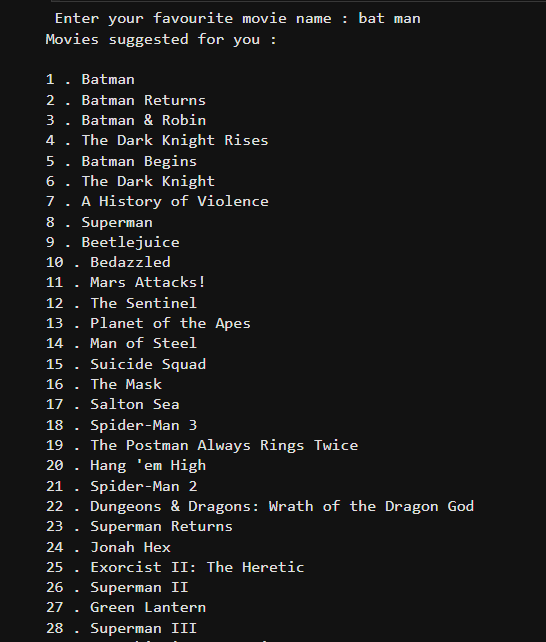

# Movie Recommendation System

This project is a movie recommendation system that predicts movies based on the user's favorite movie. The system converts movie features into feature vectors using feature vectorization and employs cosine similarity to make predictions.

## How It Works

1. **Feature Vectorization**: Converts the features of movies into numerical vectors.
2. **Cosine Similarity**: Measures the similarity between the feature vectors to find movies similar to the user's favorite movie.

## Learning Source

This project was developed based on concepts learned from a YouTube tutorial.

## Technologies Used

- **Programming Language**: Python
- **Libraries**: NumPy, Pandas, Scikit-learn

## Screenshots

